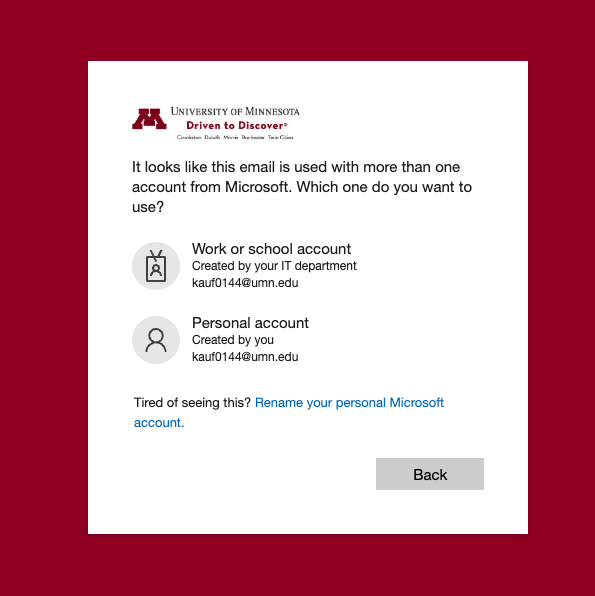
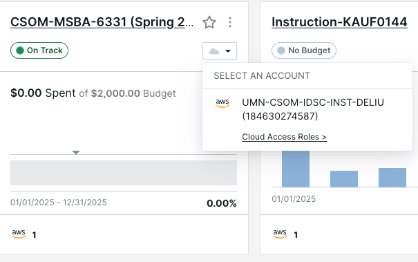
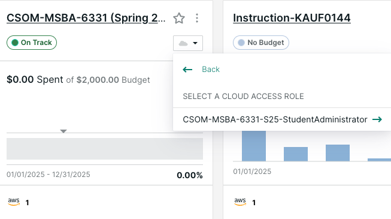
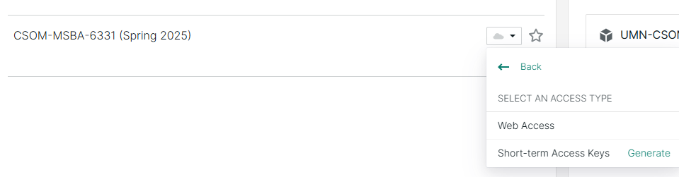
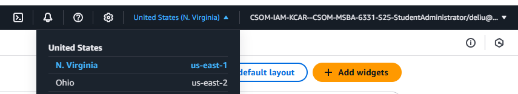
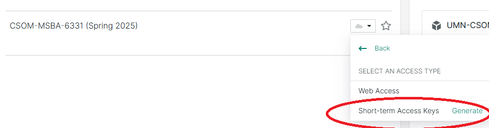

Please follow these directions to login and start using your account: 

1. Navigate to [kion.csom.umn.edu](https://kion.csom.umn.edu) and click **UMN Internet ID**
2. Provide your **UMN email**
3. If you are asked to choose between Work and Personal accounts, choose **Work or School Account**.  

4. You'll see a KION dashboard
5. Find the project **CSOM-MSBA-6331 (Spring 2025)**, click the **cloud icon** 

6. Click **Cloud Access Roles** and select the **StudentAdministrator** role

7. Choose **web access** to access the **AWS console**

8. Switch to United States (**N. Virginia**) (**us-east-1**) if the current region is not.  

9. Once there, you can access Bedrock via the console. 
      - Claude 3.7/3.5 models have been enabled by default.
      - If you need other models, go to  **Bedrock configurations** > **Model access** > **Modify model access** > click **Available to request** of the model request a model to added. 
10. Obtain Access Token (for API access) - if you need it. 
      - At the KION project **CSOM-MSBA-6331 (Spring 2025)**, select access type **Short-term Access Keys** to view access keys and instructions. Click on **Generate** to generate new ones.
      